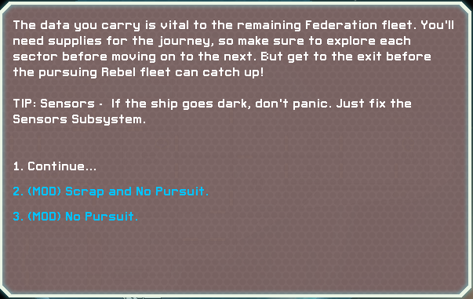

# FTLMod-SNP: Scrap No Pursuit

A transformative mod for **FTL: Faster Than Light** that removes the Rebel Fleet pursuit and gives players unlimited scrap from the start, allowing for unrestricted experimentation and exploration.

### Features

- **Unlimited Scrap**: Start your journey with infinite scrap, enabling you to upgrade your ship to your heart's content right from the start.
- **No Rebel Fleet Pursuit**: Explore sectors at your own pace without the looming pressure of fleet advancement.
- **Freedom to Experiment**: Test ship builds, strategies, and layouts without resource limitations or time constraints.

### Installation

1. Download the mod from the Releases section.
2. Use Slipstream Mod Manager to install the mod.
3. Launch FTL and enjoy ultimate freedom!

### Compatibility

- Compatible with FTL: Advanced Edition.
- May conflict with mods that modify starting resources or sector mechanics.

### Contributions

Contributions and feedback are welcome! Open an issue or submit a pull request to help improve this mod.

### License

This project is open-source and available under the MIT License.
